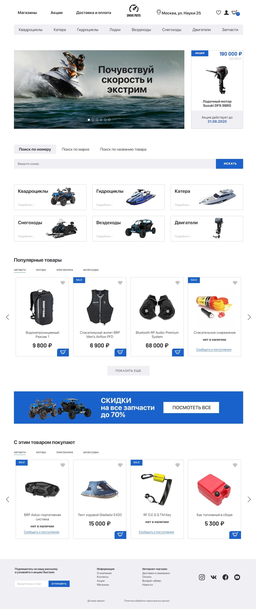

##### <a href="https://kazankovstas.github.io/DriveMoto/">View Live</a>

**Drive Moto** - Landing Page.

    - Адаптивность сетки: мобильная, планшетная и десктопная версии (responsive layout)
    - Используемая методология: БЭМ.
    - Используемый препроцессор: Sass
    - Используемый инструмент автоматизации: Gulp

<table>
  <tr>
    <th>Main</th>
    <th>Main Mobile</th>
  </tr>
  <tr valign="top">
    <td>
        
    </td>
    <td>
        
    </td>
  </tr>
</table>

<table>
  <tr>
    <th>Catalog</th>
    <th>Catalog Mobile</th>
  </tr>
  <tr valign="top">
    <td>
        
    </td>
    <td>
        
    </td>
  </tr>
</table>

<table>
  <tr>
    <th>Product</th>
    <th>Product Mobile</th>
  </tr>
  <tr valign="top">
    <td>
        
    </td>
    <td>
        
    </td>
  </tr>
</table>
